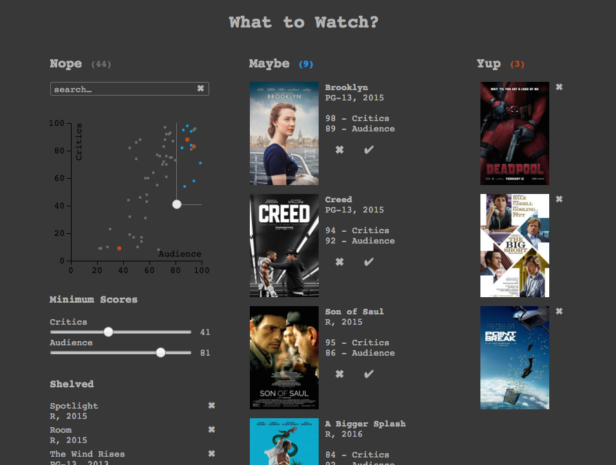
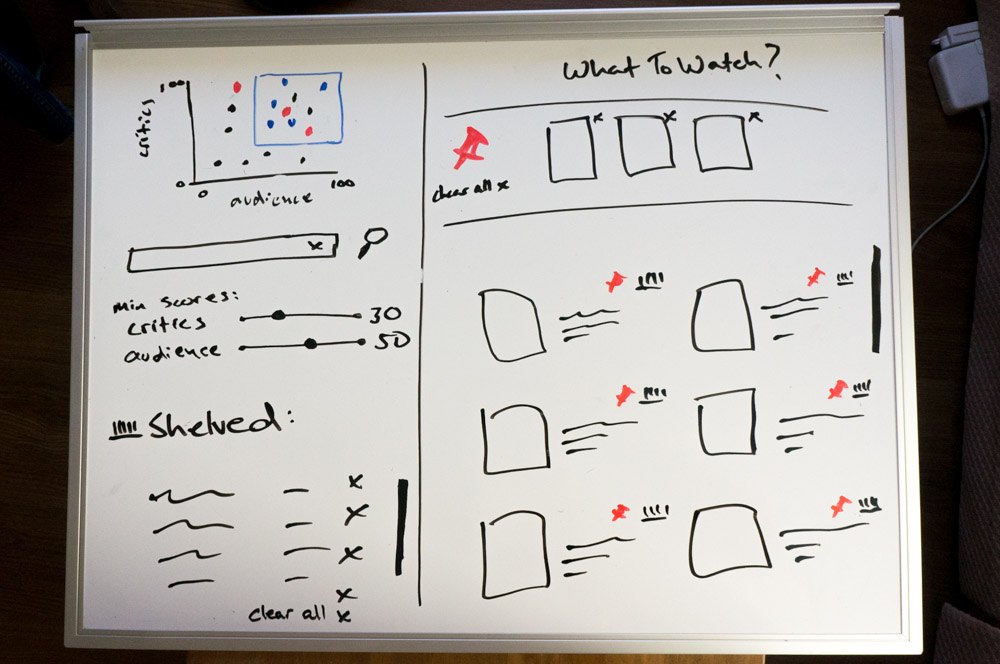

# What to Watch?

This is a demo of a basic web app that helps people decide what to watch next. The goal was to allow people to quickly narrow down a long list of shows and come up with a few suggestions.

The app revolves around a Tinder-like 'yup' / 'nope' experience, with some additional filtering on top. The user can either 'save' a movie or 'shelve' it:



Any item can be opened to see additional details and get linked to other informational sites.

A small visualization is included in the top-left corner which shows the distribution of audience and critic ratings, as well as the current saved/shelved state. The audience and critic minimum ratings can be adjusted concurrently using the draggable handle in the chart.

## Requirements & Setup

Tested with Python 3.5.1 and Django 1.9.

```
pip install -r requirements.txt   # requires Django 1.9
python manage.py migrate
python manage.py loaddata movie_fixture.json  # populate DB
python manage.py runserver
```

## Implementation Notes

* Data extraction and pre-processing is performed using a [Jupyter](http://jupyter.org/) Python notebook in the `data-utils` directory.
* Poster thumbnails are delivered in sprite sheets for efficiency.
* High-level data is included with the initial request by the server so all filtering can happen client-side. Additional movie meta-data is retrieved on-demand.
* Front-end is implemented in [riot.js](http://riotjs.com/).
* Chart built with [D3.js](https://d3js.org/)
* For the sake of simplicity, this Django application conflates the concept of 'projects' and 'apps', putting both into a hybrid project/app module called `starter`.


## Missing Features

* Ability to handle an arbitrary number of movies. Current limit is unknown.
* Check if it's available to stream on Netflix
* Per-user customization, including saving app state
* Better layout and scrolling behaviors
* Convert Jupyter notebook to command-line Python scripts
* Ensemble RNN-based recommendation engine
* ...


## Design

The initial sketch, based on the use case: "what should I watch next?"




## Copyright

All code is freely usable under the MIT license.

Data is from the Rotten Tomatoes API and may be copyrighted by them? Also there are some posters in here, which are probably copyrighted by the studios. 

